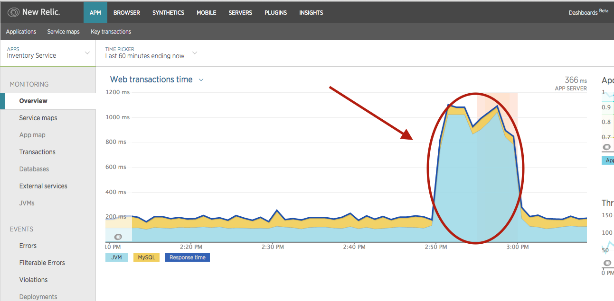
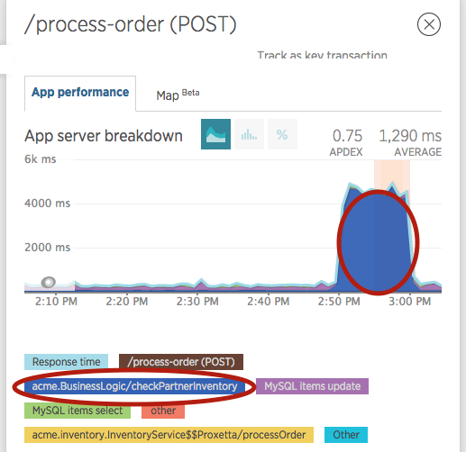
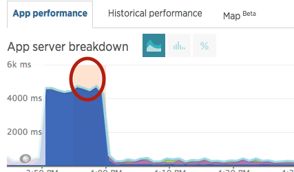

# Showing APM in Action with Demotron
Purpose: Familiarize students with using APM to solve a problem similar to the one in the exercise. 

## Objectives:
By the end of an interactive session, students should be able to:
*  Use the common user interface elements and motifs to navigate in APM
*  Determine what transactions are slow
*  Analyze a transaction to find where time is spent

## Common user interface elements and Navigation
### Steps
  1. Log in as New Relic Administrator, then switch to another account. Explain difference between accounts and logins. Explain importance of NOT using account 1. 
  1. Log into the [Demotron application](https://rpm.newrelic.com/accounts/541497/applications) on newrelic.com. 
  1. Show the list of applications as an example of the "list" motif.
  1. Choose the Inventory Service application.

### Exercise 
  * Students set up personal New Relic account and download the newrelic.yml file for a Ruby app. 
  
## Determine a slow transaction
### Steps
  1. Navigate to APM Overview page. Explain the common Overview elements and the navigation on the left. 
  1. Set time picker to at least 1 hour. 
  1. Point out spikes in transaction time.  
  1. In Transaction section, click */process-order(POST)* to navigate to Transactions tab.![Transacation section] (screenshots/transactions_1.png)
  1. On Transactions tab, show the bulk of the transaction is in acme.BusinessLogic/checkPartnerInventory. 
  1. In Transaction traces section, click on a trace to show Synthetic transaction trace. 
action Traces] (screenshots/trace_1.png)  **NOTE** If no traces show up, just talk through steps 10 through 12. 
  1. Click on Trace Details tab. 
  1. Click magnifying glass next to acme.BuinessLogin/checkPartnerInventory to expand stack trace. ![Expand Stack Trace] (screenshots/trace_detail_1.png)
  1. [Optional] Explain that problem can be debugged by walking up (down) the stack to InventoryService.processOrder. Show code for processOrder -- it is passing a large delay if the time is 10 minutes before the top of the hour.
### Exercise
  * Find the trace details and SQL statements for the LoopController problem

## More Navigation 
  1. Close Synthetics monitor pop up.
  1. Click on red vertical bar of graph. This navigates to the Alerts product. 
  1. Explain that Alerts shows warnings and then critical violation due to errors.
  1. Click "Inventory Service Overview" to navigate back to APM.
  1. If possible, show a Deployment marker. 
### Exercise
  * Fix the ruby kata according to instructions, redeploy and test
