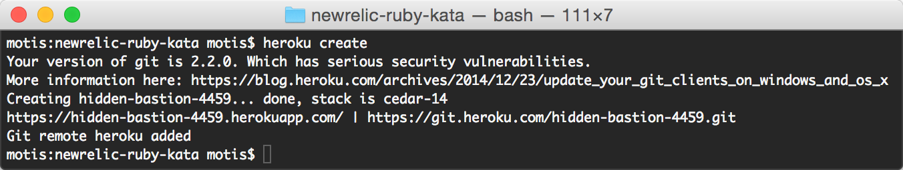
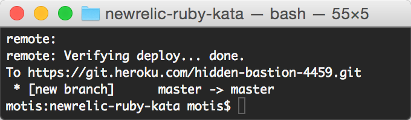
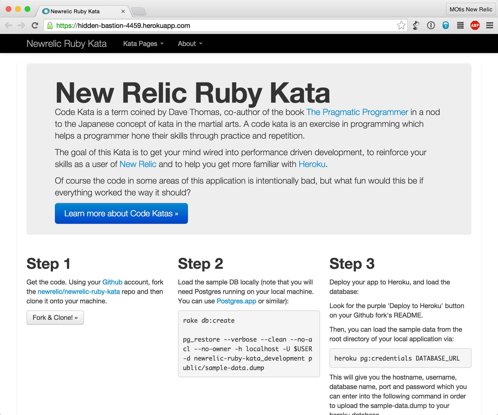
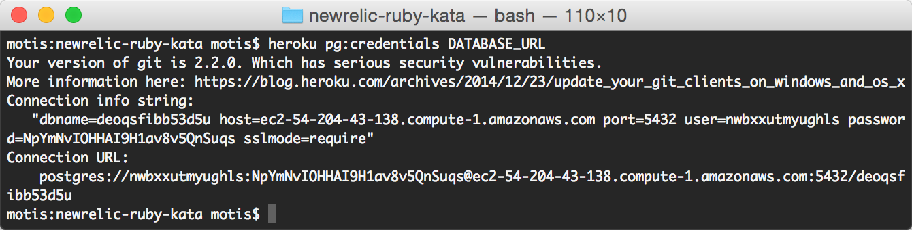
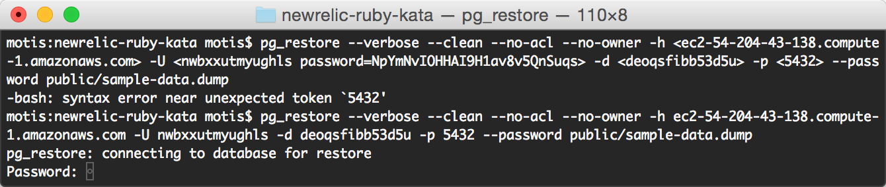
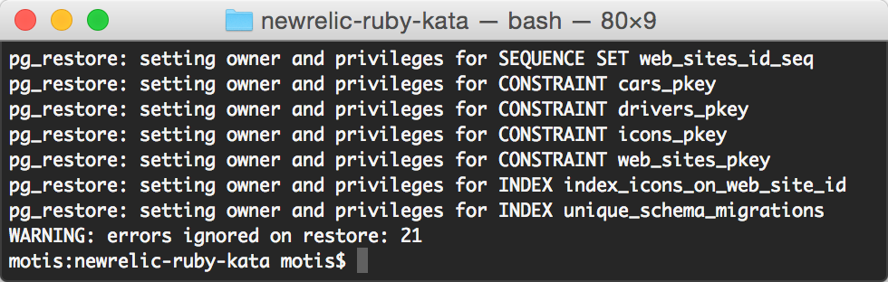

Previous step: [Setup Software](setup_software.md)  
Next step: Continue the [Main Project](readme.md)

# Setup Heroku 

1. Create an Heroku account
2. Install the Heroku Toolbelt
3. Deploy the working app to Heroku
4. Test the app on Heroku
5. Update the database on Heroku
6. View your website


## Create an Heroku account

Go to Heroku.com and follow the instructions using your @newrelic.com email address

**Note**: Heroku might ask for a credit card, but it’s not charged when using a free account as used in this exercise.


## Install the Heroku Toolbelt

Go here: https://toolbelt.heroku.com/  
Download and install the Heroku Toolbelt

Once installed test that the Heroku Toolbelt is functioning:

1. In terminal make sure you are in your *newrelic-ruby-kata* directory.  
For example:  ```$ cd code/engineering-training/newrelic-ruby-kata```
1. Verify you are logged into Heroku via terminal: ```$ heroku login```


## Deploy the working app to Heroku

Follow the instructions here:  
https://devcenter.heroku.com/articles/getting-started-with-ruby#deploy-the-app

Which should look like the following: 

* Create an app on Heroku: ```$ heroku create```  
  
If this chokes, it likely means you aren’t logged in to Heroku via terminal. ```$ heroku login```
* Deploy your code:  ```$ git push heroku master```  
  

Congrats! Your web app is deployed!

**Note**: Where ‘master’ is the name of the branch in heroku. If you want to push something other than ‘master’ from your local machine you can do something like:  
  ```
  $ git push heroku exercise-test:master
  ```


## Test the app on Heroku

Configure and Verify deployment by doing the following:

* Try opening the web app from a browswer
```$ heroku open```  


Success!  

You now have a real ruby app running on a real website with a real URL. Email the link to your family and friends!  
(if you want, but you probably really don’t actually want to)


## Update the database on Heroku

Go to **Kata Pages > The Loop**

Notice how it barfs?  Let's find out why.  Type ```heroku logs``` into your command prompt, and look for the phrase *Internal Server Error:*

```bash
$ heroku logs
...
2015-09-18T17:35:54.315055+00:00 app[web.1]: Completed 500 Internal Server Error in 20ms (ActiveRecord: 2.1ms)
...
2015-09-18T17:35:54.313685+00:00 app[web.1]: PG::UndefinedTable: ERROR:  relation "web_sites" does not exist
...
```

We're getting a database error, because the database hasn’t been updated on Heroku.  We need to populate the database.

* First get more information about where and how the database is deployed
```$ heroku pg:credentials DATABASE_URL```  

* Now restore the PostgreSQL database from the archive file: sample-data.dump using the values given by “Connection info string:” above:  
  `pg_restore --verbose --clean --no-acl --no-owner -h` _HOSTNAME_ `-U ` _USER_ `-d ` _DATABASE_ `-p ` _PORT_ `--password public/sample-data.dump`
**Don't just copy-pasta the text, you need to rebuild it using the values you got**
 * Where:
   * _HOSTNAME_ is the part after "host=": _ec2-54-204-43-138.compute-1.amazonaws.com_
   * _USER_ is the part after "user=": _nwbxxutmyughls_
   * _DATABASE_ is the part after "dbname=": _deoqsfibb53d5u_
   * _PORT_ is the part after "port=": _5432_
   * Note that your password does *not* go onto the command line; `pg_restore` will prompt you.
 * For example:  
  ```pg_restore --verbose --clean --no-acl --no-owner -h ec2-54-204-43-138.compute-1.amazonaws.com -U nwbxxutmyughls -d deoqsfibb53d5u -p 5432 --password public/sample-data.dump```
**Don't just copy-pasta the text, you need to rebuild it using the values you got**  

 * And use the password given in the “Connection info string:"
 * Lots of cool stuff should happen, and then this:  
 


## View your website

Now view your website running on the internet:

Either:  

Refresh the webpage you already have open  
or use the command ```$ heroku open```

This will launch your app in a browser window

Double-check that the database is running properly by going to **Kata Pages > The Loop**

If that page loads (slowly) then you win!

Next step: Continue the [Main Project](readme.md)
