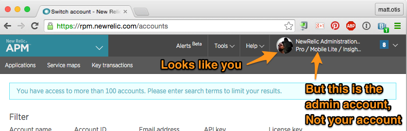
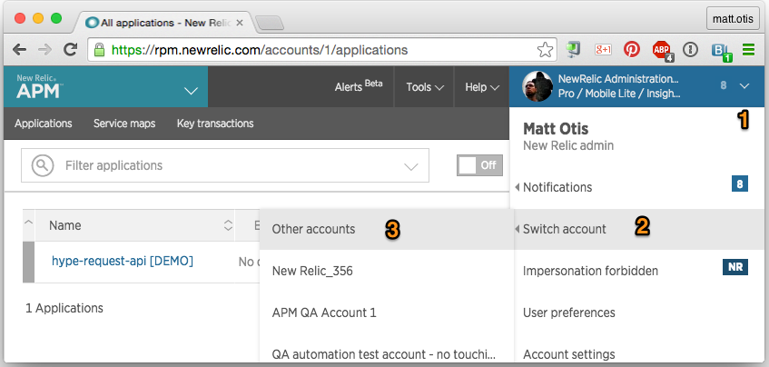
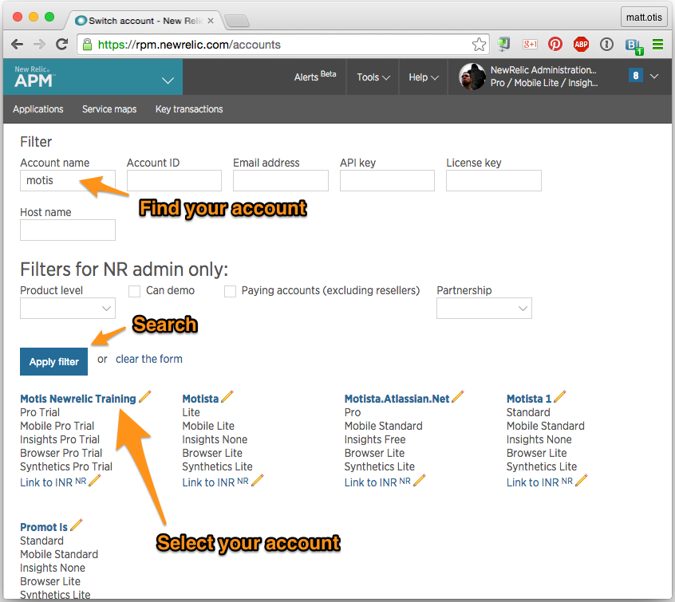
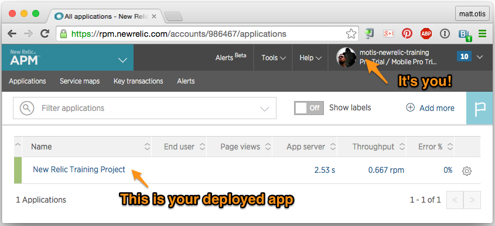

# Using your Personal New Relic Account 
 
 The New Relic account "1" is the account that is used to monitor New Relic servers. You should not use it to monitor the ruby kata for this exercise. Instead, you will use your own account. 
 Follow the instructions on this page to set up and log into your own account. 
 
## Getting a personal New Relic account
1. Sign in to newrelic.com
1. If you see something like this, log out of the account.  
  
1. Click the Sign Up for New Relic button at newrelic.com
 - *Your Company* = <username>-newrelic-training (for example: motis-newrelic-training)
 - *Number of App Servers* = 1-2
 - *Which platforms would you like to monitor?* = ruby (and any others that interest you)
1. Go to rpm.newrelic.com, make sure you’re signed in and on your drop down choose Switch Account and find the one that was what you named for *Your Company*
 1. Or go to “Other Accounts” and search for your newly created account.  
 **Note**: If you don’t do this then you’ll end up being on the main admin account, Account 1. And then tinkering in here will make people grumpy as we predominantly use Account 1 to monitor ourselves.
 
1. Optionally, upgrade to a New Relic Pro Account for personal use by following
[New Relic Pro for new (and old!) Relics](https://newrelic.atlassian.net/wiki/display/it/New+Relic+Pro+for+new+%28and+old%21%29+Relics)

## How to switch accounts from Account 1 to your account
Once you have your personal New Relic account, you will need to switch to the account whenever you log in to New Relic. 

Step 1  

Step 2  

Step 3 (If you have not started monitoring an appliciation yet, skip this step) 

------
