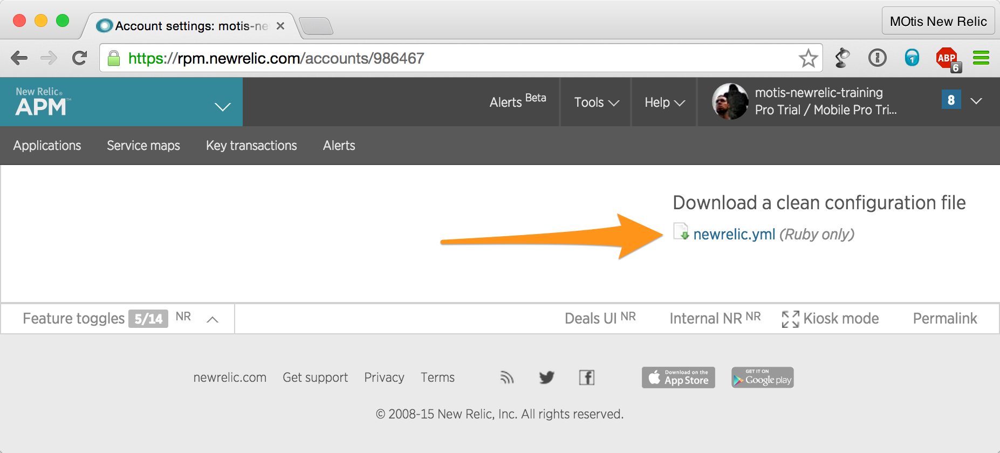

# Newb Relic Main Project

## Overview

In this exercise you will learn how to use the main suite of New Relic products (APM, Synthetics, Browser, and Insights) by deploying an application with New Relic installed for reporting, monitoring the application to see where improvements need to be made, and making improvements until the application meets our specifications.

## Exercise Objectives

* Setup AWS
* Create a New Relic account
* Install the New Relic agent
* Deploy a web app with our agent
* Monitor the web app
* Use data to solve biggest problems first
* Do a proper dev cycle and redeploy as needed until the app is within specification
* Do long-term monitoring with Synthetics
* Analyze results over time with Insights

## Setup AWS EC2 Instance
[Understand and setup the AWS EC2 environment] (aws_environment.md)  

## Create a New Relic account
[Set up a personal New Relic account] (prereqs/setup_personal_nr.md)

## Exercise Instructions
1. Start the rails server
1. Explore the Ruby Kata
1. Install the New Relic Ruby Agent
1. Generate Data
1. View Data in APM
1. Setup Reliability Monitoring
1. Fix an N+1 issue
1. Fix more issues as needed

## Start the Rails Server
In this section you will explore the source code and play with a running instance of the Ruby Kata.

1. Log into your virtual server as explained [here](aws_environment.md)
1. Change to the directory for the kata:
```cd /home/ec2-user/newrelic-ruby-kata-newb-relic-master/```
1. Note that this is a Ruby On Rails application, with the standard layout of source files.
1. Start the rails server from the newrelic-ruby-kata-newb-relic-master directory:  
   ```rails server -b 0.0.0.0```

## Explore the Ruby Kata
1. In your web browser, open the Ruby kata, using the IP address supplied for your virtual server. For instance: ```http://[PUT YOUR IP ADDRESS HERE]:3000```  
1. Explore the application.
1. The application should be slow because training. 
1. Shutdown the server by typing ````Ctrl + C```` in terminal


### Take it one server at a time.

If you try to start the rails server and rails gives me a message like the following:

```A server is already running. Check /home/ec2-user/newrelic-ruby-kata-newb-relic-master/tmp/pids/server.pid.```

Don't panic; you've got this.  Stop that server by running ```pkill ruby``` and carry on.
 
 
## Use New Relic

Now use New Relic to monitor this app and fix...


Actually you can't, because you haven't installed the New Relic Agent on your code, so it's not reporting anywhere


## Install the New Relic Ruby Agent

In this section you will install the Ruby Agent, which gathers information about the Ruby Kata's performance. 

1. *Installing the gem*
 1. Add the gem to line 36 of Gemfile and save the file (The [nano editor](http://guides.macrumors.com/nano) and vi are available on the image):  
  ```gem 'newrelic_rpm', '>=3.6.8'```
 1. Run bundle install to update the Gemfile.lock:  
  ```bundle install```
1. *Installing the configuration file*
 1. Download the configuration file from the Account Settings page on newrelic.com to your local computer
  
 1. Open a new terminal windows from your laptop.  
 1. In the new windows, use the secure copy command to transfer the file to the AWS EC2 instance:  
    ```scp -i [PUT THE PATH TO PEM FILE HERE]  newrelic.yml ec2-user@[PUT THE VIRTUAL SERVER PUBLIC DNS HERE]:/home/ec2-user/newrelic-ruby-kata-newb-relic-master/config```  
   for instance:  
   ```scp -i newb-relic-master-key-pair newrelic.yml ec2-user@ec2-52-32-56-39.us-west-2.compute.amazonaws.com:/home/ec2-user/newrelic-ruby-kata-newb-relic-master/config```  
 1. Exit the new window; you will no longer need it. 
 1. In your AWS instance, edit the newrelic.yml file and update the *app_name:* in the Development section to be something more relevant like: *New Relic Training Project*. (The [nano editor](http://guides.macrumors.com/nano) and vi are available on the image). 

That’s it! You are ready to restart the rails server and get some data into New Relic!


## Generate Data

* Start the rails server from the newrelic-ruby-kata-newb-relic-master directory using "nohup" so that it can run even if your terminal window exits:  
   ```nohup rails server -b 0.0.0.0 &```
* **Note the number that shows up when you launch the server. This is the process ID. You will need it when you shutdown the rails server.** 
* In your web browser, load all the pages that you can via the drop-down menu.  
* This should be slow because training.  
* Wait for each page to finish loading.  
* Load each page twice for good measure for more data.  


## View Data in APM

* Go to rpm.newrelic.com (make sure you’re logged in)  
* Click APM
* Select the app with the Name you gave it above (i.e. New Relic Training Project)
* Look at the graphs
* What’s causing the biggest problems? 

## Setup Reliability Monitoring

Any web app you have running you'll want to have some long-term monitors setup so that you can see how the web app is running and immediately identify when things go wrong. In order to do this we're going to use New Relic Synthetics.  

We only really need to test once per minute for this web app. You can either setup 1 location 1x per minute or N locations every N minutes. Create a Simple monitor to visit "The Loop" page or a Scripted Browser monitor that visits all pages (see the "cheat mode" section for a script that visits the pages). 

1. Log into newrelic.com
2. Click the "Synthetics" link at the top of the page
3. Follow the instructions here:  
https://docs.newrelic.com/docs/synthetics/new-relic-synthetics/using-monitors/add-edit-monitors#adding-monitors

#### Cheat-mode engaged
Use the script in [../solutions/synthetics_script.md](../../solutions/synthetics_script.md) as the script for the monitor.  

-----


## Fix an N+1 issue

Let’s start with *LoopController#index* (We're going to skip the biggest problem under transactions: *async/index.html.erb Template*)

* Look in the piece of code indicated to see if you can find the issue
* Keep digging down all the way, see if you can find the sql commands

If you know ruby, stop here and see if you can fix the issue yourself

-----

#### Cheat-mode engaged

If you don't know ruby, here's what's happening:

The website is trying to load information while in the view instead of while in the controller. 

Update the controller to load the info there by changing line 3 of loop_controller.rb to:  
```@sites = WebSite.limit(1000).includes(:icon)```

This now includes the icons from the models in the controller, and that way when the view runs its code everything should already be loaded.

For more detail look at video Erica Lauer Vose made that explains using New Relic to find this specific Kata problem.  
https://newrelic.wistia.com/medias/9p0v0qgmza

-----

### Run the fixed code

* Save the changes to the updated the code.
* Shutdown the server, using the process ID you noted when you started it: 
```kill -9 [PUT THE PROCESS ID HERE]```
* Restart the server to pick up the change:  
```nohup rails server -b 0.0.0.0 &```
* Create a deployment marker that will show up on the New Relic graphs for your application:  
```$ newrelic deployments "Fixed the dreaded N+1 problem in LoopController" ```  
*NOTE:* If you get a licensing error when running the command, change directory to the config directory and try again: 
```cd config```

Now let’s refresh the page and click around some more and see what happens later in New Relic


## Keep fixing issues

Repeat the above steps of clicking on a page, finding major errors, fixing those errors, re-deploying code until all major issues are resolved and pages load quickly.

## Fix a Browser Issue

Coming soon!

We'll add to the Ruby Kata to have a Javascript error that we didn't know was happening until we use New Relic Browser. Once we see that there's an issue we'll go find the code that's causing a problem, fix it, and then see happiness in New Relic

## Insights

Coming soon!

We'll take a look at our application in Insights and see if there's any other interesting data that we can find regarding this application and how we've fixed it.


#Conclusion

What did they learn and why did you use their time? 

How does this help them towards the course goal or towards their career goals?
