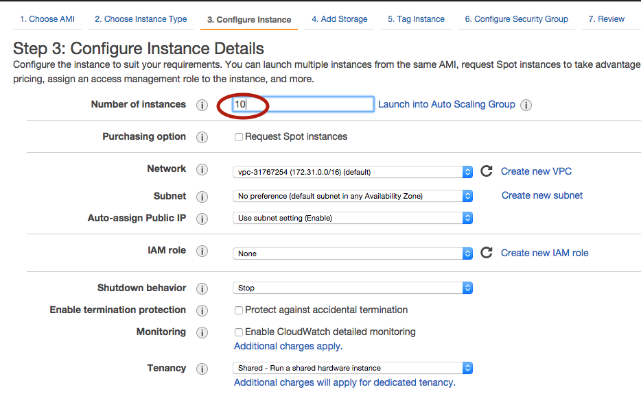
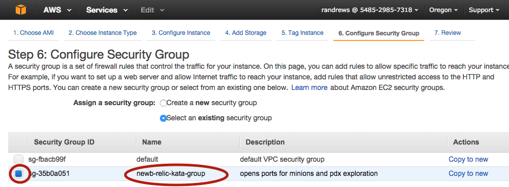

# Creating AWS Instances for Students
The project in Newb Relic requires that each student has an instance of an Amazon Web Services (AWS) EC2 (Elastic Compute Cloud) virtual server. This page gives instructions for creating those images and assigning them to students.   

# Prerequisites
* You will need to have an AWS account. Work with the Site Engineering team to get an account and make sure you can log in. 
* You will need access to the Amazon Machine Image (AMI) used to create the virtual servers. Contact [Ruby Andrews](mailto:randrews@newrelic.com) to request access. She will need to know your AWS account number. For details, see: http://docs.aws.amazon.com/AWSEC2/latest/UserGuide/sharingamis-explicit.html  

# Creating the Instances
1. Go to the EC2 Dashboard.
1. Click "Launch Instance". 
1. Click "My AMIs" on left.
1. Click "Select" next to "Newb Relic Golden Master".
1. Click the square on the left column of the "t2.small" row.
1. Click "Next: Configure Instance Details".
1. Enter the number of students in "Number of instances" box. 
1. Click Next: Add Storage.
1. There is nothing to do on this page, so click Next: Tag Instance.
1. There is nothing to do on this page, so click Next: Configure Security Group.
1. Click "Select an existing security group".
1. Click the square on the left column of the "newb-relic-kata-group" row.
1. Click "Review and Launch".  
1. Click "Launch".  
1. In the first drop down, select "Create a new key pair".  
1. Enter "newb_relic_instance_key" in the "Key pair name" box.  
1. Click "Download Key Pair". This will download a file to your laptop.
1. Save the file in a directory where you can find it later. You will need to provide this file to every student. 
1. Run this command to make the file not publicly viewable: ```chmod 400 newb-relic-master-key-pair.pem ```
1. Click Launch Instances

# Testing the Instances
1. Click View Instances 
1. Do the following for each instance: 
   1. Select the box on the left 
   1. Click Connect
   1. Copy the ssh command from the dialog (art/ssh_command)
   1. Paste the command into a terminal window open to the directory where you saved the pem file but DO NOT PRESS ENTER
   1. Change "root" to "ec2-user"
   1. Press Enter
   1. Verify that the connection works
   1. Close the dialog in the web browser
   1. Set the Name of the image to the name of the student who will own it
   1. Select Actions > Stop
   1. Click Yes, Stop

# Communicating the Connection Information
You will need to tell each student about the instance created for him or her and provide the .pem file from the "Creating the Instance" section.

1. Transfer the .pem file to the student in a secure manner (not over email), such as by sharing it on a thumbdrive.  
1. Send the student an email with the following information for his or her instance
  * Public DNS -- This is the "address" the student will use to connect to your instance.
  * Public IP address -- This is the address the student will use when you are testing your kata in your browser.  

Here is suggested email content: 
```
Hello,
Below are details about a virtual server you can use to complete the exercise for the Newb Relic course. You will need these details AND a file I will supply in class to connect to the server and work through the exercise.
These details are unique to your instance; other students in the class will have different values for these fields. SAVE THIS EMAIL so you can refer to it in class.
Public DNS – [PUT DNS HERE]
Public IP address — [PUT IP ADDRESS HERE]
In class we will distribute the key you will need to connect, then you can get started by following the steps here:
https://source.datanerd.us/engineering-training/newb-relic/blob/master/exercises/main-project/aws_environment.md
And completing the exercise here:
https://source.datanerd.us/engineering-training/newb-relic/blob/master/exercises/main-project/readme.md
See you in class!!
```


